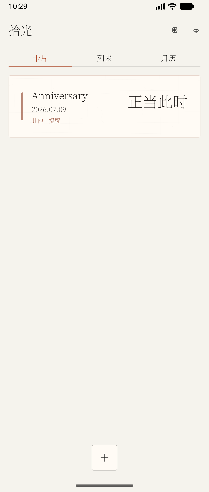
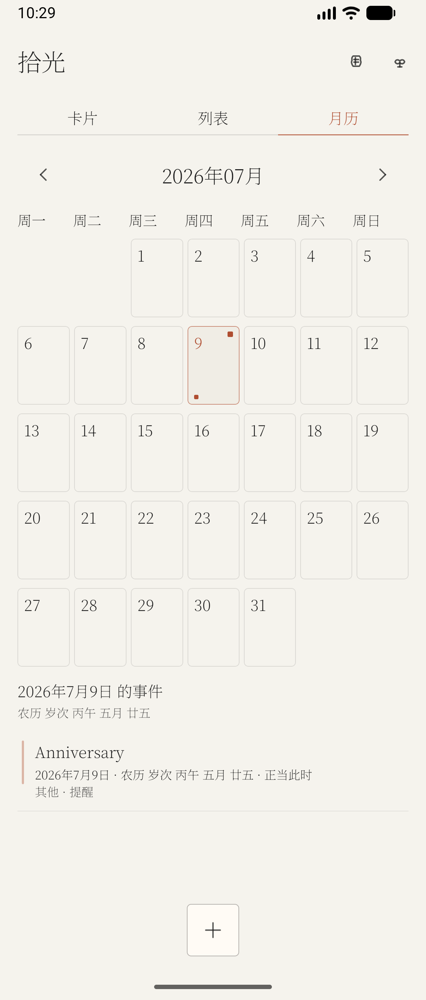
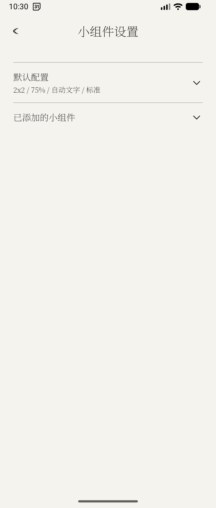
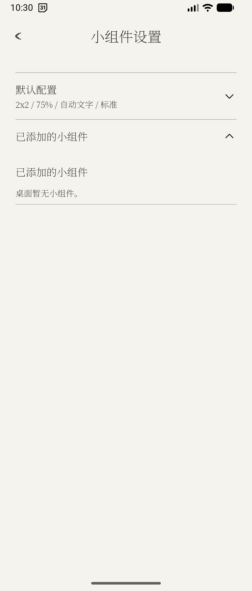

# 拾光（Glimmer）`v3.17`

拾光是一款面向 Android 的倒数日、生日与纪念日应用。它把日子整理成安静的纸笺、月历和桌面小组件，让重要时刻能被看见，也能被系统提醒与日历同步照顾到。

当前版本 `3.17` 已完成发布验证，重点打磨桌面小组件、设置结构、启动体验与事件输入链路，是一个可公开分发的稳定版本。

[下载 v3.17 APK](https://github.com/Francesco502/glimmer-countdown-app/releases/tag/v3.17)

## 界面预览

| 首页纸笺 | 月历视图 |
|---|---|
|  |  |

| 设置入口 | 小组件设置 |
|---|---|
|  |  |

## 3.17 版本亮点

- 独立小组件设置：小组件配置从主题设置中拆出，默认配置、已有小组件和字号调整集中管理。
- 更像系统原生的小组件：25% / 50% / 75% 玻璃背景调整为更柔和的乳白磨砂层，弱化边线，优化圆角和文字颜色。
- 更清晰的尺寸表达：宽高设置改为“预览宽度 / 预览高度”，支持 1-5 格预览配置，避免误解为能强制改变桌面物理尺寸。
- 已有小组件复用编辑页：编辑已有桌面小组件时打开与新增一致的配置页，不再在列表里展开长表单。
- 更可靠的新建体验：修复标题输入焦点、拼音组合态和硬件键盘模式下 IME 不显示的问题。
- 更稳妥的日历同步：只检查设备里已有可写系统日历；没有可写日历时明确提示，不自动创建本地日历。
- 更干净的启动体验：只保留系统启动页，移除应用内过渡页，避免启动内容重复闪现。

## 核心能力

- 记录倒数日、生日、纪念日和普通事件。
- 同时支持公历与农历日期。
- 支持按天、周、月、半年、年重复。
- 支持“提前 N 天 + 固定时间”的提醒配置。
- 支持系统通知、系统日历同步、权限处理和同步状态反馈。
- 首页提供卡片、列表、月历三种浏览方式，支持搜索、筛选、置顶和自定义排序。
- 桌面小组件支持透明 / 半透明 / 宣纸 / 青瓷 / 朱印等视觉方案，并可配置内容范围、排序、密度、边框、圆角和文字模式。
- 支持 JSON 导入 / 导出，并可导入“记得日子” `.mdb` 备份文件。

## 版本信息

- `versionName`: `3.17`
- `versionCode`: `22`
- 发布日期：`2026-07-08`
- Direct APK: `glimmer-countdown-3-17.apk`
- Play AAB: `app-play-release.aab`

## 构建与运行

```bash
# Direct 渠道 Debug
./gradlew installDirectDebug

# Play 渠道 Debug
./gradlew installPlayDebug
```

```bash
# Direct 渠道 Release APK
./gradlew assembleDirectRelease

# Play 渠道 Release AAB
./gradlew bundlePlayRelease
```

默认产物路径：

- `app/build/outputs/apk/direct/release/glimmer-countdown-3-17.apk`
- `app/build/outputs/bundle/playRelease/app-play-release.aab`

## 发布与验证

3.17 发布前已通过：

- `testDirectDebugUnitTest`
- `testPlayDebugUnitTest`
- `compileDirectDebugAndroidTestKotlin`
- `lintDirectDebug lintDirectRelease lintPlayRelease lintVitalDirectRelease lintVitalPlayRelease`
- `assembleDirectRelease assemblePlayRelease bundlePlayRelease`
- Direct release APK 模拟器 smoke test
- Direct 渠道 GitHub Release 更新检查

更多发布记录：

- [CHANGELOG.md](CHANGELOG.md)
- [docs/RELEASE_CHECKLIST.md](docs/RELEASE_CHECKLIST.md)
- [docs/GITHUB_AND_RELEASE.md](docs/GITHUB_AND_RELEASE.md)
- [docs/release_and_update_guide.md](docs/release_and_update_guide.md)
