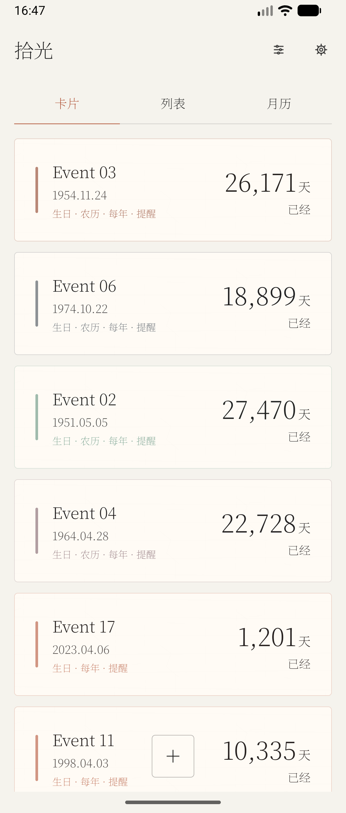
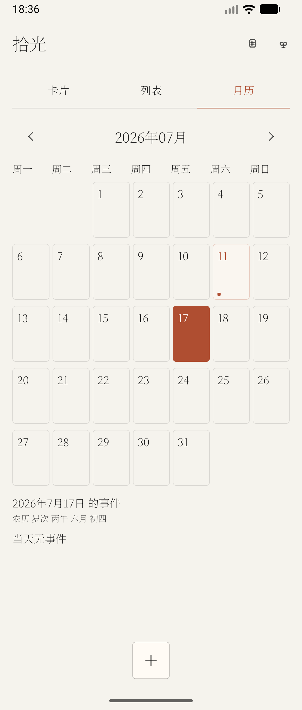
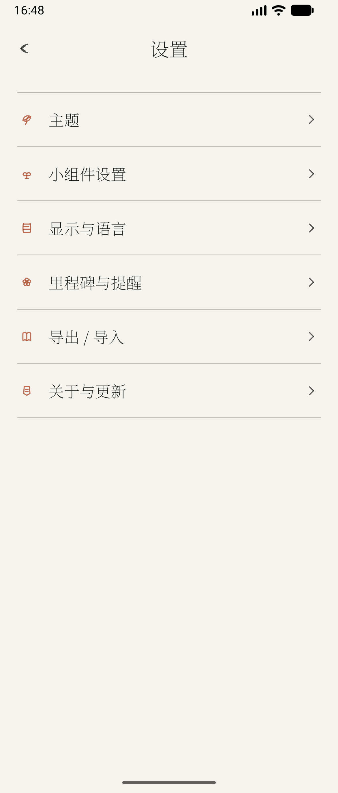
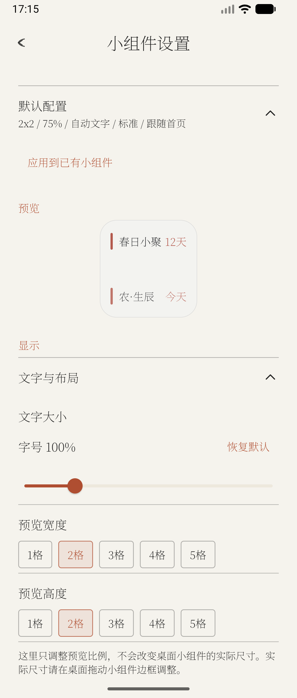

# 拾光（Glimmer）4.0

拾光是一款面向 Android 的倒数日、生日与纪念日应用。它把日子整理成安静的纸笺、月历和桌面小组件，让重要时刻能被看见，也能被系统提醒与日历同步照顾到。

拾光 `4.0` 是面向长期使用与公开分发的成熟产品版本，于 2026-07-20 通过 GitHub Release 正式发布。完整验证与明确豁免项记录在 [4.0 发布检查清单](docs/RELEASE_CHECKLIST.md)。

**唯一正式发布渠道：GitHub Release。** `4.0` 的唯一官方工件是 Direct APK `glimmer-countdown-4-0.apk`。Play flavor 仅保留用于兼容性与开发回归，不是 4.0 正式发布工件或阻断项。

最新公开版本为 `4.0`：[下载 v4.0 APK](https://github.com/Francesco502/glimmer-countdown-app/releases/tag/v4.0)

## 界面预览

`docs/screenshots/4.0` 已于 2026-07-20 基于最终 4.0 候选重新生成：首页与月历使用项目内 22 条脱敏事件，设置与小组件页使用应用内置预览数据，并覆盖首页满宽卡片、月历、设置与小组件预览。图片与 `v4.0` 的代码和资源一致；后续版本若改变界面须重新生成。

| 首页纸笺 | 月历视图 |
|---|---|
|  |  |

| 设置入口 | 小组件设置 |
|---|---|
|  |  |

## 4.0 成熟版目标

- 数据可靠：导入、导出、升级和异常数据处理均有可重复验证，用户事件不会因版本切换静默丢失。
- 核心链路成熟：新建、编辑、删除、撤销、提醒、日历同步、分享和更新检查形成完整且可解释的状态反馈。
- 首页与小组件一致：置顶、按天数、按日期和自定义排序共享同一规则；小组件“跟随首页”不再产生独立顺序。
- 桌面体验可靠：继续支持 1-5 格“预览宽度 / 预览高度”、独立配置、内容范围、外观、密度和文字模式，并完成真实 Launcher 回归。
- 发布质量可审计：正式 Direct APK 的签名、唯一 GitHub 资产、线上回装、无障碍和模拟器性能均以证据为准；物理真机验收由发布负责人明确豁免并在清单中保留为未执行，Play flavor 回归不构成发布门。

## 核心能力

- 记录倒数日、生日、纪念日和普通事件。
- 同时支持公历与农历日期。
- 支持按天、周、月、半年、年重复。
- 支持“提前 N 天 + 固定时间”的提醒配置。
- 支持系统通知、系统日历同步、权限处理和同步状态反馈。
- 首页提供卡片、列表、月历三种浏览方式，支持搜索、筛选、置顶和自定义排序。
- 桌面小组件支持透明 / 半透明 / 宣纸 / 青瓷 / 朱印等视觉方案，并可配置内容范围、排序、密度、边框、圆角和文字模式。
- 支持 JSON 导入 / 导出，并可导入“记得日子” `.mdb` 备份文件。

## 版本信息

- `versionName`: `4.0`
- `versionCode`: `23`
- 发布状态：正式发布（2026-07-20）
- Direct APK：`glimmer-countdown-4-0.apk`

## 构建与运行

```bash
# Direct 渠道 Debug
./gradlew installDirectDebug

# Play 渠道 Debug
./gradlew installPlayDebug
```

```bash
# Direct 渠道 Release APK
./gradlew assembleDirectRelease

# Play flavor 开发回归（非正式发布门）
./gradlew testPlayDebugUnitTest assemblePlayDebug
```

默认产物路径：

- `app/build/outputs/apk/direct/release/glimmer-countdown-4-0.apk`

## 发布与验证

4.0 正式发布执行包含：

- `testDirectDebugUnitTest`
- `compileDirectDebugAndroidTestKotlin`
- `lintDirectDebug lintDirectRelease lintVitalDirectRelease`
- `assembleDirectRelease`
- Direct release APK 正式证书、精确证书指纹与 SHA-256 验证
- Direct release APK 的 API 37 模拟器安装 / 升级、性能与更新 smoke；物理真机验收由发布负责人明确豁免
- GitHub Release 只保留 `glimmer-countdown-4-0.apk`，并完成线上重装、更新检查与关键链路 smoke

最终候选完成了正式证书 Direct APK 的构建、签名、权限、哈希及模拟器原地升级验证；PowerShell publisher 的十类隔离状态机场景也已通过。publisher 会拒绝脏工作区或未指向 exact tag 的 `HEAD`，并核对输出元数据与 APK 的真实包名、版本、权限和非调试状态。发布流程禁止移动已推送的 `v4.0` tag 或覆盖已发布 Release，GitHub Release 仅上传 exact Direct APK。

正式发布必须在代码与文档提交且工作区干净后推送不可变 tag，再从该 tag commit 新鲜构建和验证签名、证书指纹、SHA-256；不得复用旧产物。publisher 会删除 owned draft 中的所有旧资产，并要求整个 Release 只保留唯一的 exact Direct APK。本地认证使用 `gh auth login` / 脚本内部 `gh auth token`，CI 才从 secret 注入 `GITHUB_TOKEN`，且不得打印凭据。现有本地认证状态不作为结论；最终发布时按此流程重新取得并验证有效的写入权限。

更多发布记录：

- [CHANGELOG.md](CHANGELOG.md)
- [docs/RELEASE_CHECKLIST.md](docs/RELEASE_CHECKLIST.md)
- [docs/GITHUB_AND_RELEASE.md](docs/GITHUB_AND_RELEASE.md)
- [docs/release_and_update_guide.md](docs/release_and_update_guide.md)
