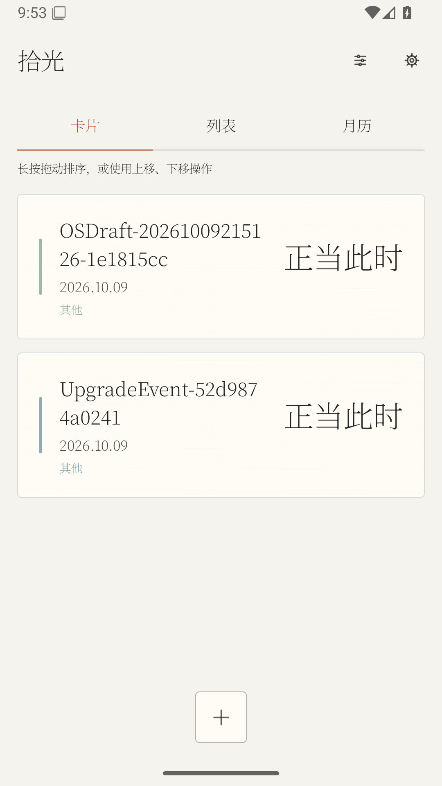
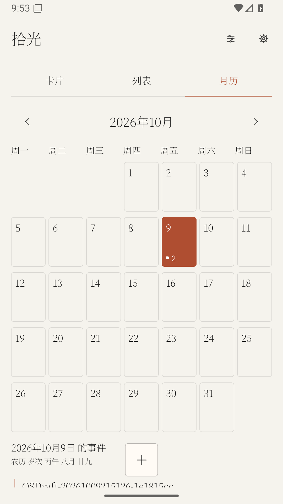
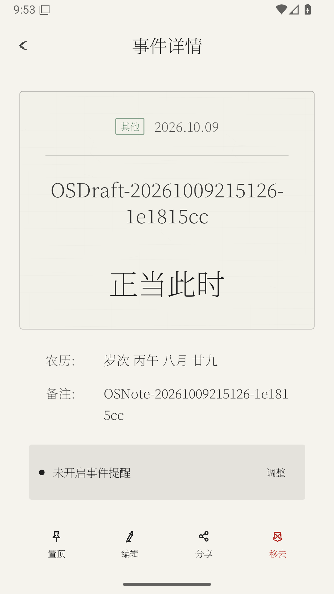
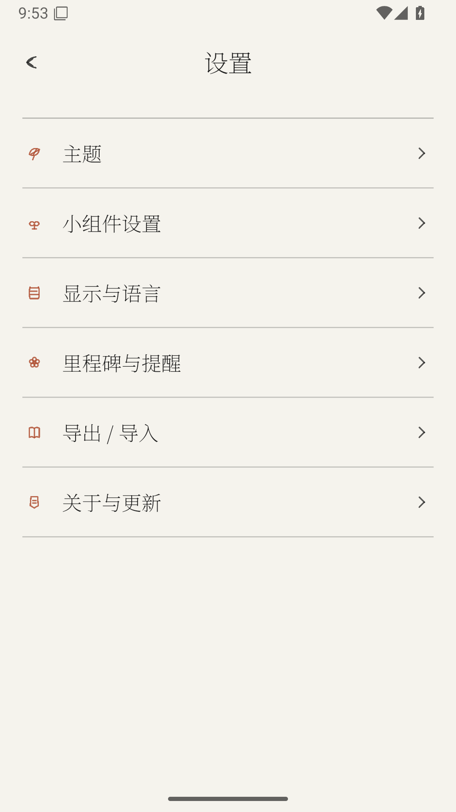
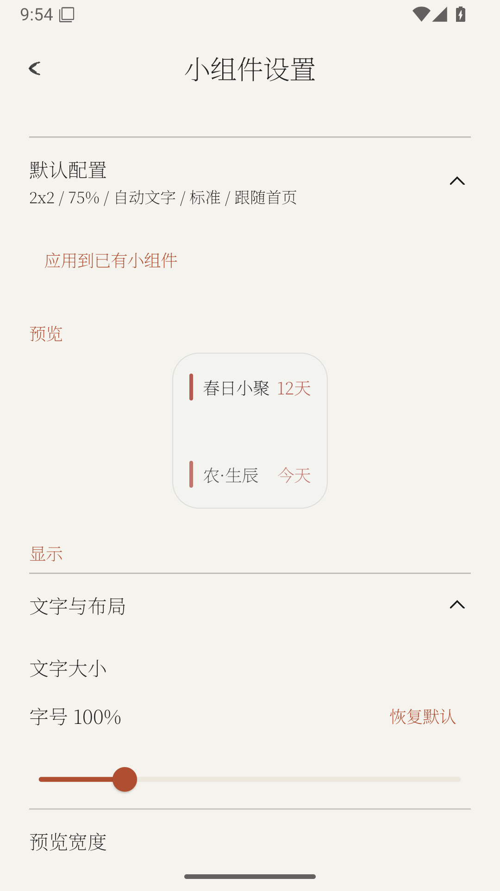
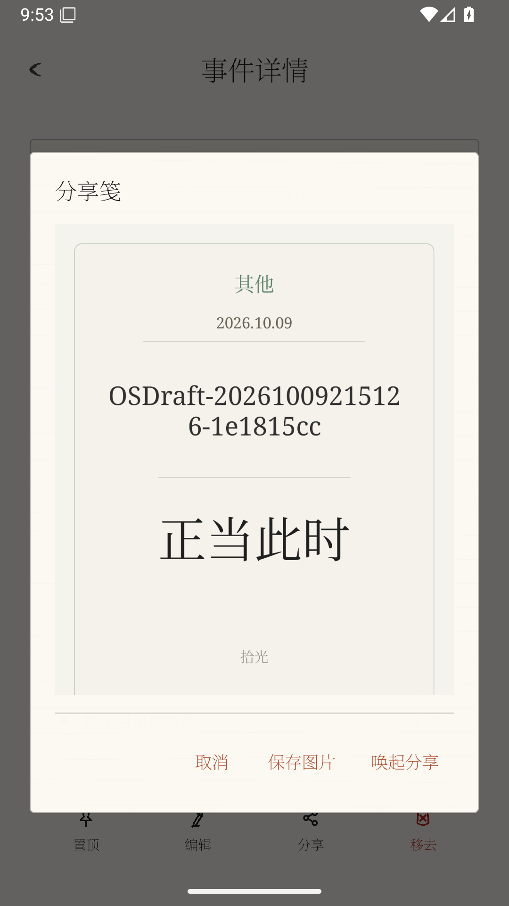
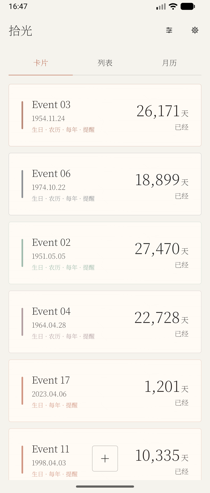
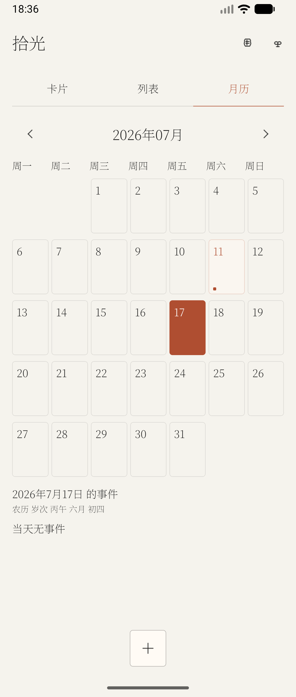
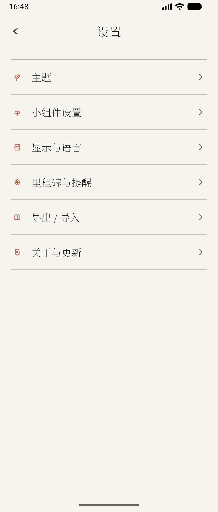
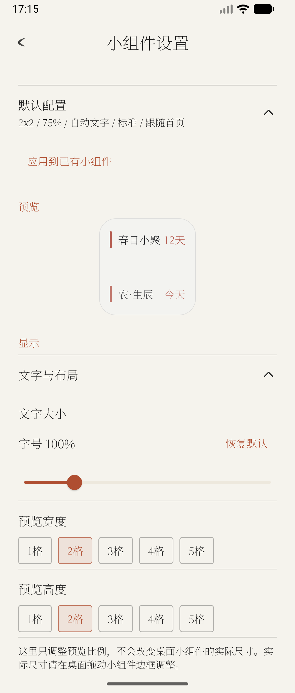

# 拾光（Glimmer）4.1

拾光是一款面向 Android 的倒数日、生日与纪念日应用。它把日子整理成安静的纸笺、月历和桌面小组件，让重要时刻能被看见，也能被系统提醒与日历同步照顾到。

`4.1` 已发布（`versionCode=24`，文档日期 2026-10-10）。修复、实际验证与剩余限制见 [4.1 发布检查清单](docs/RELEASE_CHECKLIST.md)。v4.0 的发布证据保存在 [历史清单](docs/releases/v4.0-checklist.md)，不作为 4.1 的通过记录或豁免。

**唯一正式发布渠道：GitHub Release。** 4.1 的唯一官方资产为 Direct APK `glimmer-countdown-4-1.apk`，复用 v4.0 正式签名，可覆盖升级。Play flavor 仅保留用于兼容性与开发回归，不是正式发布工件或阻断项。

最新公开版本为 `4.1`：[下载 v4.1 APK](https://github.com/Francesco502/glimmer-countdown-app/releases/tag/v4.1)

## 4.1 模拟器界面

以下截图来自线上正式 APK，按同一最终候选与新鲜构建核验，绑定不可变 `v4.1` 标签。环境为 API36、411dp、字体1.0；事件为 QA 夹具，小组件截图是应用内预览。原图来源、哈希与验证范围见[截图记录](docs/screenshots/4.1/README.md)。

| 首页 | 月历 |
|---|---|
|  |  |

| 详情 | 设置 |
|---|---|
|  |  |

| 应用内小组件预览 | 分享预览 |
|---|---|
|  |  |

## 历史界面预览（v4.0）

以下 `docs/screenshots/4.0` 图片是 v4.0 历史截图，本轮不将这些截图视为发布证据，也不把历史图片标为 4.1 界面。

| 首页纸笺 | 月历视图 |
|---|---|
|  |  |

| 设置入口 | 小组件设置 |
|---|---|
|  |  |

## 4.1 修复与优化

- 修复普通事件产生虚假日历权限错误的清理路径，同时保留真实受管日历记录的删除保护。
- 完善编辑草稿恢复、保存任务生命周期、连续输入、导入防重复执行和更新下载完整性。
- 接入 24 小时内小时显示，统一详情页的时间与偏好，明确固定天数纪念节点和周年的区别。
- 改善筛选条件反馈、返回关闭工具面板、排序无障碍、短窗口月历和分享图片的一致性。
- 保留桌面小组件独立配置与 1-5 格“预览宽度 / 预览高度”，完善配置恢复、保存反馈；Launcher 实际表现仍待真机验收。

最终 APK 从不可变标签 `6c52a3a0e7f495e015f12c035ea94bd614fc2813` 新鲜构建并正式签名，公开下载的大小、哈希、证书与版本一致。当前无实体手机；通知实际到达、物理设备日历、Launcher 小组件与长期性能未完成物理验收，不继承 v4.0 豁免。完整主题/字体、自然低内存回收和分享接收方读取/交付也不在本次结论范围。

## 核心能力

- 记录倒数日、生日、纪念日和普通事件。
- 同时支持公历与农历日期。
- 支持按天、周、月、半年、年重复。
- 支持“提前 N 天 + 固定时间”的提醒配置。
- 支持系统通知、系统日历同步、权限处理和同步状态反馈。
- 首页提供卡片、列表、月历三种浏览方式，支持搜索、筛选、置顶和自定义排序。
- 桌面小组件支持透明 / 半透明 / 宣纸 / 青瓷 / 朱印等视觉方案，并可配置内容范围、排序、密度、边框、圆角和文字模式。
- 支持 JSON 导入 / 导出，并可导入“记得日子” `.mdb` 备份文件。

## 版本信息

- `versionName`: `4.1`
- `versionCode`: `24`
- 发布状态：已发布（2026-10-10）
- Direct APK 目标文件名：`glimmer-countdown-4-1.apk`

## 构建与运行

```bash
# Direct 渠道 Debug
./gradlew installDirectDebug

# Play 渠道 Debug
./gradlew installPlayDebug
```

```bash
# Direct 渠道 Release APK
./gradlew assembleDirectRelease

# Play flavor 开发回归（非正式发布门）
./gradlew testPlayDebugUnitTest assemblePlayDebug
```

默认产物路径：

- `app/build/outputs/apk/direct/release/glimmer-countdown-4-1.apk`

## 发布与验证

4.1 正式发布要求包含，实际结果以当前清单为准：

- `testDirectDebugUnitTest`
- `compileDirectDebugAndroidTestKotlin`
- `lintDirectDebug lintDirectRelease lintVitalDirectRelease`
- `assembleDirectRelease`，或按[发布指引](docs/release_and_update_guide.md#三构建命令)从最终 tag 的 CI 未签名 Release 工件在本机完成正式签名
- Direct release APK 正式证书、精确证书指纹与 SHA-256 验证
- Direct release APK 的模拟器安装 / 升级、性能与更新 smoke；物理手机安装、提醒、日历与 Launcher 验收当前未执行，按现有发布授权记录剩余限制
- GitHub Release 只保留 `glimmer-countdown-4-1.apk`，并完成公开下载复验、线上重装、更新检查与关键链路 smoke

2026-10-10 [最终标签 CI](https://github.com/Francesco502/glimmer-countdown-app/actions/runs/37990007930)：Direct/Play JVM各575/575、原生49/49、publisher10/10、lint无error，R8新鲜构建通过。[最终正式签名QA](https://github.com/Francesco502/glimmer-countdown-app/actions/runs/37992543286) 在API26/31/36全部通过覆盖升级、精确数据保留与进程恢复；API36五页、真实相册保存和分享选择器返回通过。正式APK为26,463,543 bytes，SHA-256 `8fbeee7590f89104995ecce98769842dc2a75cf84d8641efd6a0c7b67619e5b4`，公开下载独立验签通过。[线上安装与更新复验](https://github.com/Francesco502/glimmer-countdown-app/actions/runs/37995185711) 三平台全部成功，API36实际更新检查显示已是最新版本；同一公开APK的五页和分享保存/返回也通过，原始范围见[清单](docs/RELEASE_CHECKLIST.md)。QA工具revision为 `6a1bdb5`，APK源码仍为上述不可变标签。

publisher 会拒绝脏工作区或未指向 exact tag 的 `HEAD`，并核对输出元数据与 APK 的真实包名、版本、权限和非调试状态。发布流程禁止移动已推送的 tag 或覆盖已发布 Release，GitHub Release 仅上传 exact Direct APK。

正式发布必须在代码与文档提交且工作区干净后推送不可变 tag，再从该 tag commit 新鲜构建和验证签名、证书指纹、SHA-256；不得复用旧产物。publisher 会删除 owned draft 中的所有旧资产，并要求整个 Release 只保留唯一的 exact Direct APK。本地认证使用 `gh auth login` / 脚本内部 `gh auth token`，CI 才从 secret 注入 `GITHUB_TOKEN`，且不得打印凭据。现有本地认证状态不作为结论；最终发布时按此流程重新取得并验证有效的写入权限。

更多发布记录：

- [CHANGELOG.md](CHANGELOG.md)
- [docs/RELEASE_CHECKLIST.md](docs/RELEASE_CHECKLIST.md)
- [docs/GITHUB_AND_RELEASE.md](docs/GITHUB_AND_RELEASE.md)
- [docs/release_and_update_guide.md](docs/release_and_update_guide.md)
